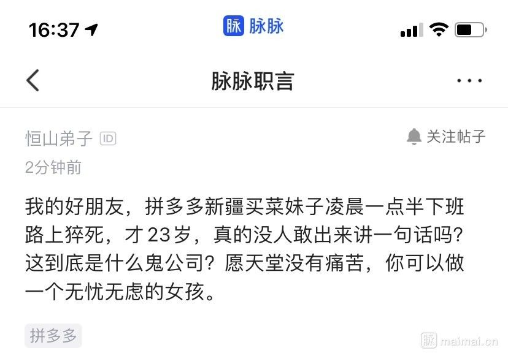
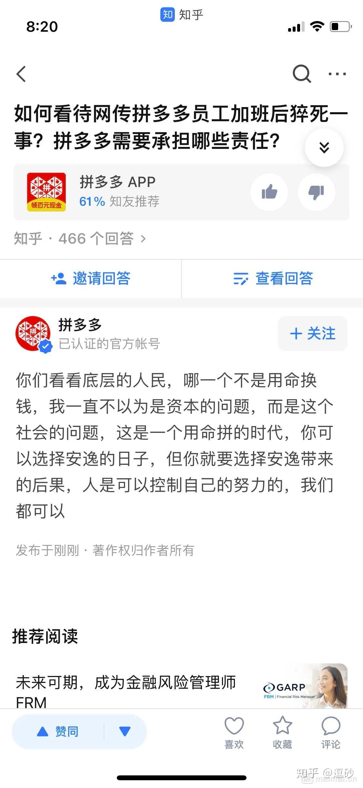
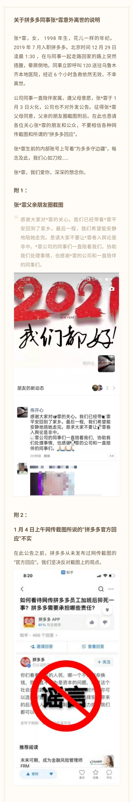
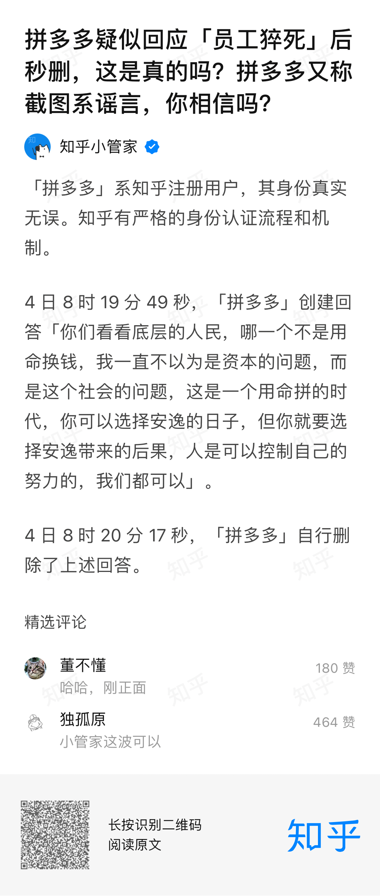
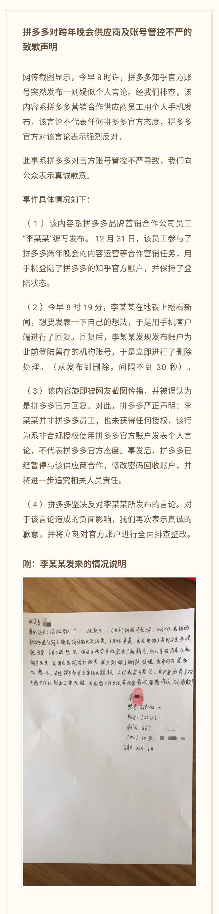

# 张某霏

愿逝者安息，愿天堂没有996。

## 事件经过

北京时间2020年12月29日凌晨1:30，拼多多公司女员工张某霏在与同事一起走路回家的路上突然捂腹，晕厥倒地。同事立即呼叫120送往乌鲁木齐本地医院，经近6个小时急救依然无效，不幸离世，于2021年1月3日火化，公司也不对外发公告。

2021年1月4日，从上海市长宁区劳动保障监察大队获悉，劳动保障监察部门已对拼多多公司的劳动用工情况进行调查，会对该公司用人合同、用工时间等情况进行检查。

2021年1月5日，新华微评：畸形加班现象必须坚决遏制。

# TODO

据网友爆料，拼多多用尽手段逼迫员工转岗去（多多）买菜，强制辞退不愿去买菜的员工，买菜一线员工全年无休超负荷工作。张小姐是在29日凌晨1：30下班回家的路上晕厥后去世的。其去世后，拼多多官方封锁消息，直至1月4日有网友在脉脉上爆料后，此事件才引起了网络上的关注和热议。之后，拼多多在知乎上回答了关于此事件的提问，然后迅速删除了答案。答案被网友截图并引起了极大愤慨与声讨，拼多多随后发布事件官方声明并称此答案截图为谣言，但被知乎官方反驳。接着，拼多多第二次发表声明称是供应商使用了官方账号进行的回答。

[拼多多微博账号关于本事件的官方说明](https://weibo.com/5692605404/JBEkamGFH?from=page_1006065692605404_profile&wvr=6&mod=weibotime)

[新浪网事件报道](https://news.sina.com.cn/o/2021-01-04/doc-iiznezxt0562683.shtml)

[如何看待网传拼多多员工加班后猝死一事？拼多多需要承担哪些责任？ - 知乎 ](https://www.zhihu.com/question/437702180)

## 事件曝光-脉脉职言

## 知乎热议

[如何看待网传拼多多员工加班后猝死一事？拼多多需要承担哪些责任？ - 知乎 ](https://www.zhihu.com/question/437702180)

###### 拼多多知乎账号在此问题下的回复(来自知乎网友截图)

**约半分钟后，该账号删除了这个回答。但已有多名网友截图并分享到了多个社交媒体上，引起了网友的热议。**

###### 随后，拼多多发表了官方声明。

**有多名网友指出了该回应中的众多疑点和不实之处，多名截图者公开表示了愿意为截图内容的真实性负责。具体可见知乎提问：**[拼多多疑似回应「员工猝死」后秒删，是真的吗？拼多多又称截图系谣言，你相信吗？ - 知乎 ](https://www.zhihu.com/question/437783708)

###### 随后，知乎官方在该问题下公开表示:

###### 对此，拼多多再次发表致歉声明，称该回答内容系合作供应商员工用个人手机发布

**知乎网友对这个答复的部分看法：**[如何评价拼多多就员工意外去世言论道歉，称知乎官方账号是跨年晚会供应商使用，你怎么看？ - 知乎 ](https://www.zhihu.com/question/437854182)

## 相关部门介入调查

据《北京青年报》星期一（1月4日）报道，上海相关劳动保障监察部门已介入调查拼多多的劳动用工情况。

https://www.cqcb.com/headline/2021-01-04/3524434_pc.html
